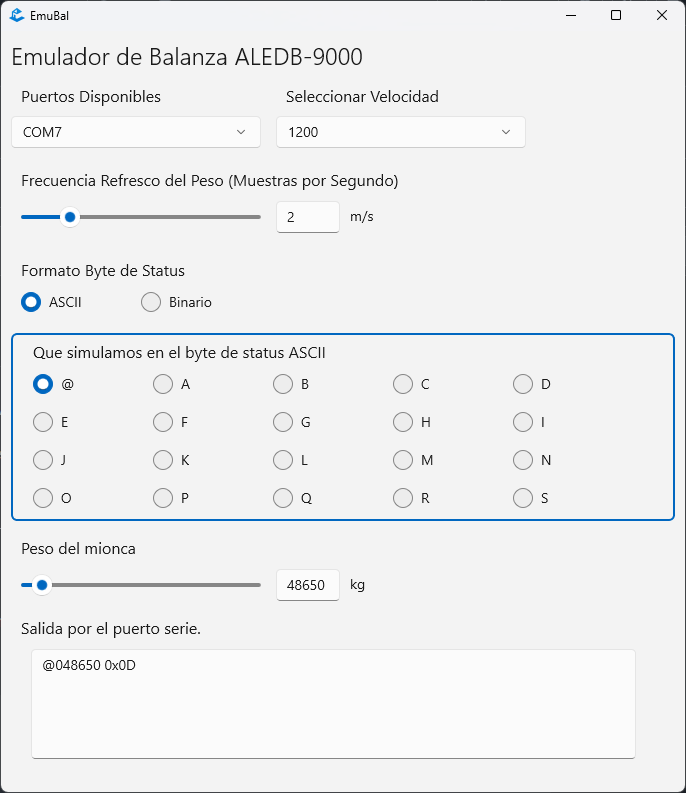

# EmuBal
### Emulador de Balanza por puerto Serie para mi Amigo el Ale.

Este programa es una Aplicación Win UI 3 (windows 10 1809 en adelante) que emula el comportamiento de una balanza comercial, enviando por el puerto serie un string similar al que enviaría una balanza comercial.

,

Cuando se ejecuta la misma, se debe seleccionar el puerto serie y la frecuencia de envío de información, es decir, la cantidad de veces por segundo que se envía la linea de texto con el  peso simulado del vehícul, junto con los flags de estado seleccionados.

### Las especificaciones de lo que manda la balanza.

SALIDA:  INDICADOR LE 100 1  (disponible en el conector tipo AMP DB9 macho)
PIN3         =      TXD
PIN5         =      GND
 
ENTRADA: EN CPU  (PUERTO SERIE)

    CON PUERTO DE 9 PINES
    PIN 2           =          RXD
    PIN 5           =          GND
    Además se deben puentear pines 4 con 6 y 7 con 8

    OPCIONAL (CUANDO HAY UN PUERTO DE 25 PINES)
    PIN 3           =          RXD
    PIN 7           =          GND
    Además se deben puentear pines 4 con 5 y 6 con 20

Los equipos se entregan programados en forma standard con los siguientes parámetros de transmisión: 
 
    1200 BAUD, 8 BIT, SIN PARIDAD, UN BIT DE STOP.
 
Se envía constantemente un string de ocho caracteres con el siguiente formato:           
 
    S P P P P P P CR
 
Donde: 

    S  = BYTE DE STATUS
    P  = PESO EN ASCII
    CR = RETORNO CARRO (Odh)

El Byte de Status se puede enviar en formato ASCII o Binario, y su siginificado es:
 
    BYTE DE ESTATUS EN BINARIO                      BYTE DE ESTATUS EN ASC II
    BIT 0:   NETO                                   @..C   : PESO POSITIVO FUERA DE EQUILIBRIO
    BIT 1:   CENTRO DE CERO                         D      : PESO BRUTO MAYOR QUE CERO
    BIT 2:   EQUILIBRIO                             E      : PESO NETO MAYOR QUE CERO
    BIT 3:   PESO NEGATIVO                          F      : CENTRO DE CERO SIN TARA
    BIT 4:   FUERA DE RANGO                         G      : CENTRO DE CERO CON TARA
    BIT 5:   0                                      H..K   : PESO NEGATIVO FUERA DE EQUILIBRIO
    BIT 6:   1                                      L..O   : PESO NEGATIVO EN EQUILIBRIO
    BIT 7:   0                                      P...   : FUERA DE RANGO

